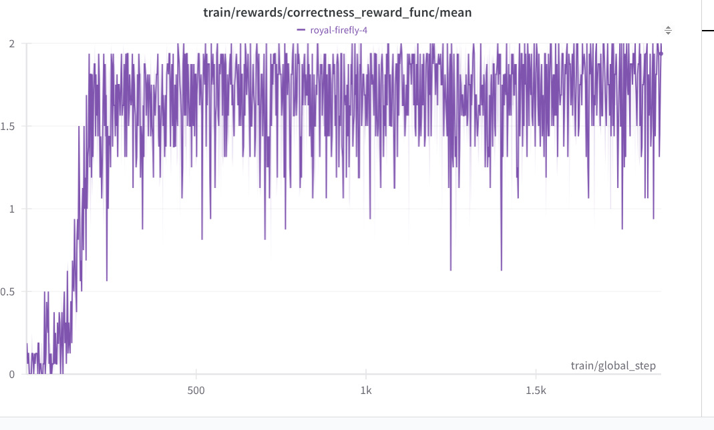
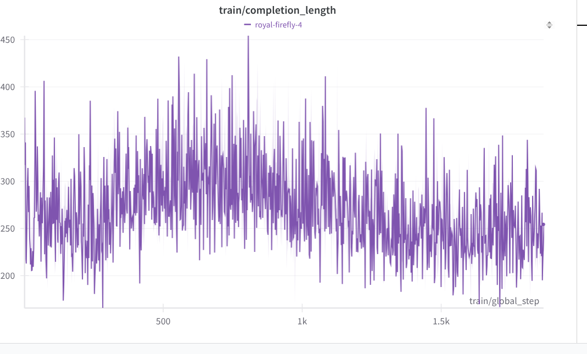
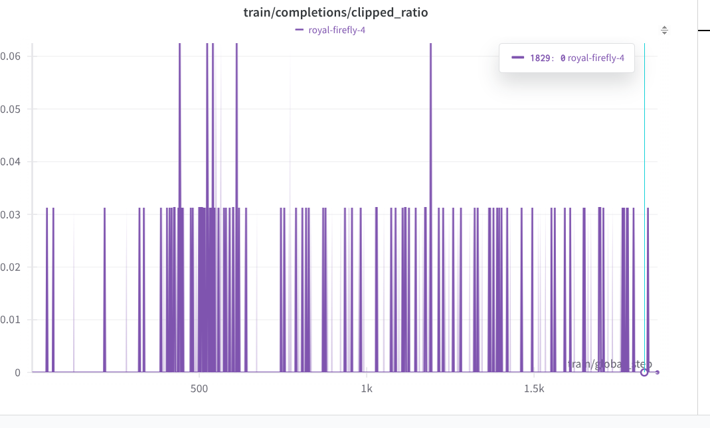

# learn_rlvr

Due to GPU memory, we use QLora to do RLVR. We use Unsloth for QLora and Huggingface TRL for GRPO.

## Qwen/Qwen2.5-3B-Instruct
### Setup
* base model: Qwen/Qwen2.5-3B-Instruct, 4bits
* lora adapter: rank 64, bf16

### Training

Since we are using QLora and we have small number paramters to train. We don't notice anything abnormal in the training.




### GSM8K Eval

| Model | PASS@1 |
| ----- | --------------- |
| Base  |69.7%|
| GRPO  |81.1%|

Eval setup
* max output token: 1024
* max sequence length: 2048
* greedy decoding
* base model
  * loaded in 4 bits
  * system prompt: 
      ```text
      Respond in the following format:
      <reasoning>
      Put your reasoning here.
      </reasoning>
      <answer>
      Put your answer here. The answer should be an integer.
      </answer>
      ```
  * user prompt:
      ```text
      {question}\nLet's think step by step.
      ```
* lora fine-tuned model
  * base model weights in 4 bits
  * weights in bf16
  * system prompt:
    ```text
    Respond in the following format:
    <reasoning>
    ...
    </reasoning>
    <answer>
    ...
    </answer>
    ```
  * user prompt:
      ```text
      {question}
      ```

The reported GSM8K metric for Qwen 2.5 3B Instruct model is 86.7. The performance difference could due to
1. different prompt: I didn't find the prompt used in Qwen 2.5 report
2. the model is loaded in 4bits

### Implementation Issues

1. when using flashinfer together with Unsloth, it complains about Ninja not find when compling flashinfer. Even through the package is installed in the conda enviorment.
   * solution: install Ninja package system wide
   * the compilation is started in a thread. Maybe python path is not properly configured
2. when evaluating GSM8K for base model and GRPOed model, we notice the response in the second batch looks strange: wrong format, repeated tokens etc
   * solution: add ```python tokenizer.padding_side="left"``` for each batch
   * for unknown reason, padding_side is reset to "right" after the first batch inference. [link](https://github.com/unslothai/unsloth/issues/267)