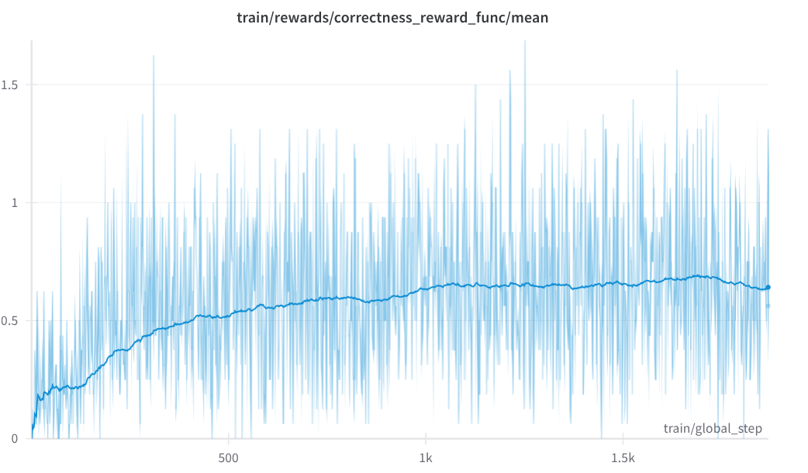

# learn_rlvr

Due to GPU memory, we use QLora to do RLVR. We use Unsloth for QLora and Huggingface TRL for GRPO.

## Qwen/Qwen2.5-3B-Instruct
### Setup
* base model: Qwen/Qwen2.5-3B-Instruct, 4bits
* lora adapter: rank 64, bf16
* KL coef is 0.0
* reward is normalized

### Training

Since we are using QLora and we have small number paramters to train. We don't notice anything abnormal in the training.


### GSM8K Eval

| Model | PASS@1 | Comment |
| ----- | ------ | ------- |
| Base  |2.1%   | 69.7% using alternative prompt  |
| GRPO  |81.1%  |  |

#### Prompt
* system prompt
    ```Respond in the following format:
    <reasoning>
    ...
    </reasoning>
    <answer>
    ...
    </answer>
    ```
* user prompt: ```{question}```

We also try following alternative prompt for base model
* system prompt
    ```Respond in the following format:
    <reasoning>
    Put your reasoning here.
    </reasoning>
    <answer>
    Put your answer here. The answer should be a numeric value.
    </answer>
    ```
* user prompt
    ```{question}\nLet's think step by step.```

#### Eval setup
* max output token: 1024
* max sequence length: 2048
* greedy decoding
* base model: loaded in 4 bits
* peft model
  * base model weights frozen in 4 bits
  * weights in bf16

The reported GSM8K metric for Qwen 2.5 3B Instruct model is 86.7. The performance difference could due to
1. different prompt: I didn't find the prompt used in Qwen 2.5 report
2. the model is loaded in 4bits
3. instruction following issue: I also saw "many" cases where the base model is able to output the correct answer but the format is wrong, e.g. instead of an integer in the `<answer>` tag, it outputs a sentence or units followed by the answer

### Implementation Issues

1. when using flashinfer together with Unsloth, it complains about Ninja build failed when compling flashinfer.
   * solution: install the latest version of Ninja
2. when evaluating GSM8K for base model and GRPOed model, we notice the response in the second batch looks strange: wrong format, repeated tokens etc
   * solution: add ```python tokenizer.padding_side="left"``` for each batch
   * for unknown reason, padding_side is reset to "right" after the first batch inference. [link](https://github.com/unslothai/unsloth/issues/267)

## Qwen/Qwen2.5-0.5B-Instruct
Qwen2.5-0.5B-Instruct doesn't follow the instruction properly. It doesn't put the thought and answer in `<reasoning></reasoning>` and `<answer></answer>` tags. As a result, we first do SFT such that the finetuned model can output in the expected format.

### SFT
We use `unsloth/OpenMathReasoning-mini` to fine tune the base model. To limit the output length, we filter the training data and only keep the data where the sequence length is less than 2048. The training and eval setup are identical as before.

| Model | PASS@1 | Comment |
| ----- | ------ | ------- |
| Base  | 0.0%   | 0.0% if append "Let's think step by step" in user turn  |
| SFT   | 8.0%   | run1, batch size=64, lr=5e-5 |
| SFT   | 19.0%   | run2, batch size=8, lr=5e-4 |

We notice smaller batch size and larger learning rate gives us a better checkpoint. We are using checkpoint from run2 for GRPO training.
### Training




### GSM8K Eval

| Model | PASS@1 | Comment |
| ----- | ------ | ------- |
| Base  | 0.0%   |  |
| SFT   | 19.0%  |  |
| SFT   | 20.3%  | using alternative prompt |
| GRPO  | 34.3%  |  |